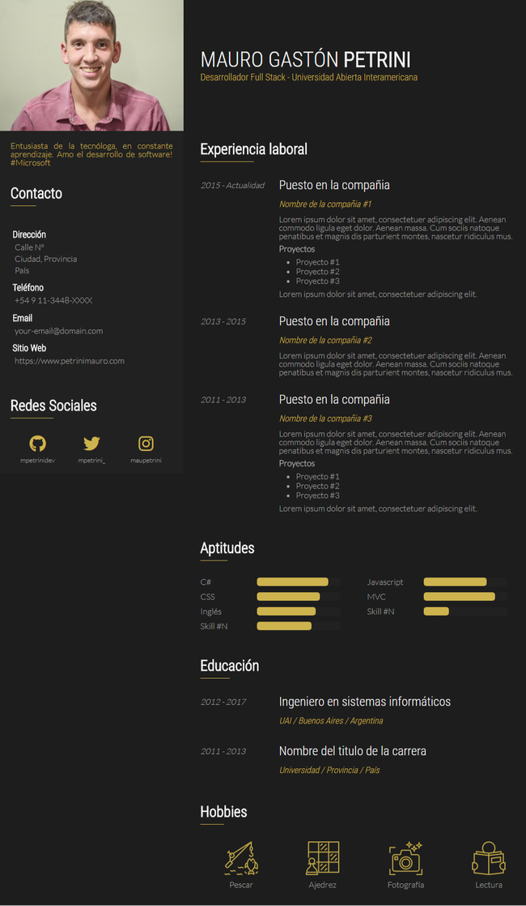
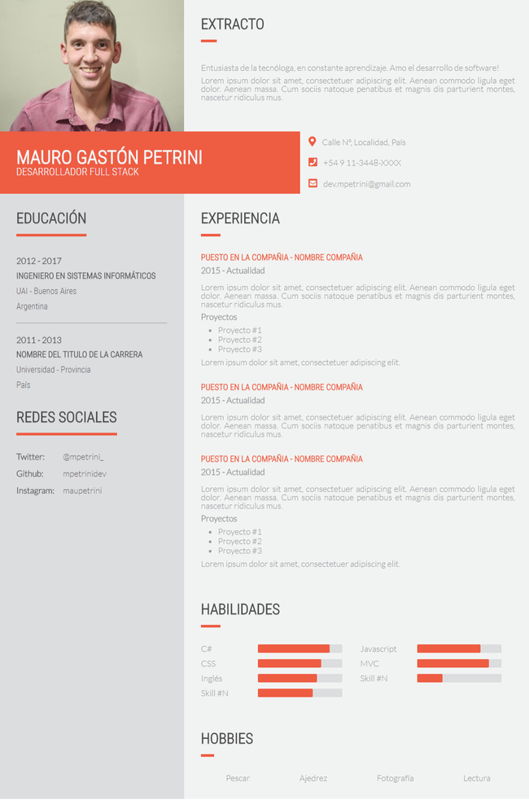

# CV's adaptables

:fire: Plantillas ultra livianas adaptables a versiones de escritorio, tablet y teléfonos móviles para mostrar de manera online tu curriculum :star: :star: :star: :star: :star:. 

Solo CSS, sin javascript! :rocket:

> :free: Las plantillas son totalmente gratuitas y se pueden personalizar según desees. 

> Sígueme en twitter [@mpetrinidev](https://www.twitter.com/mpetrinidev) por más novedades

## Secciones en las plantillas

* Extracto (breve descripción personal)
* Contacto
* Experiencia laboral
* Aptitudes / Habilidades
* Educación
* Hobbies

> Plantilla #1 - [Click para ir a la plantilla!](https://mpetrinidev.github.io/css-grid-cvs/demo-1/index.html)

> Plantilla #2 - [Click para ir a la plantilla!](https://mpetrinidev.github.io/css-grid-cvs/demo-2/index.html)

## Compatibilidad

* Google Chrome >= v.57
* Firefox >= v.52
* Edge >= v.16 | partial >= v.12 <= v.15
* Safari >= v.10.1

>[Si este proyecto te ha ayudado, puedes colaborar con una pequeña donación (el valor que desees) a través de este enlace de paypal.](https://www.paypal.me/mpetrinidev)

>Sígueme en twitter [@mpetrinidev](https://www.twitter.com/mpetrinidev) por más novedades